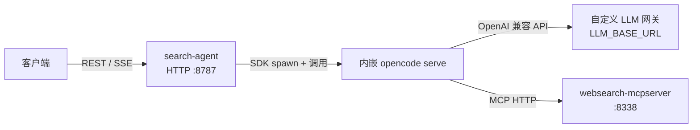
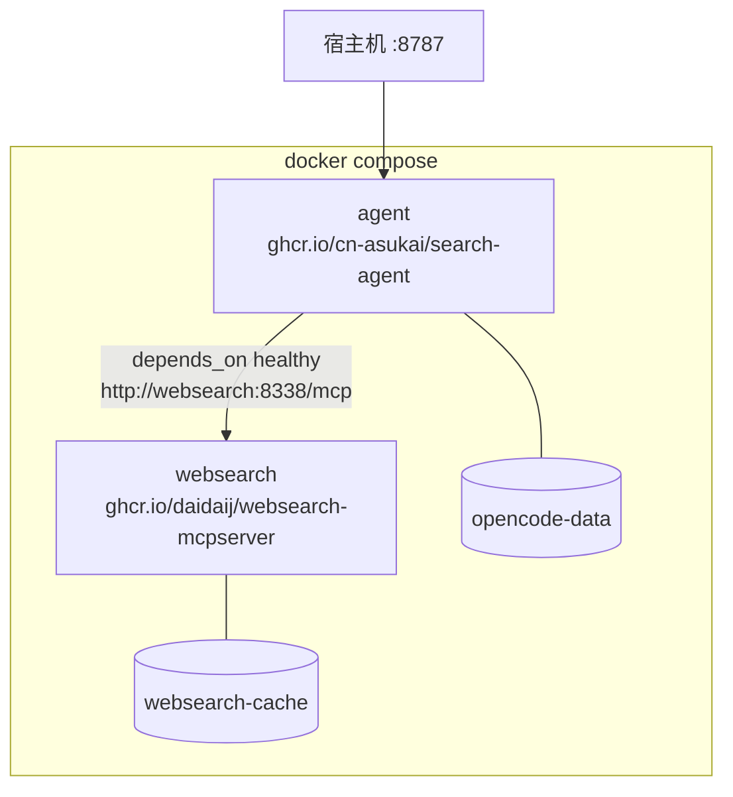
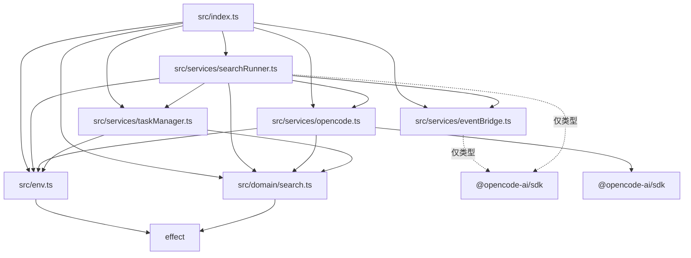
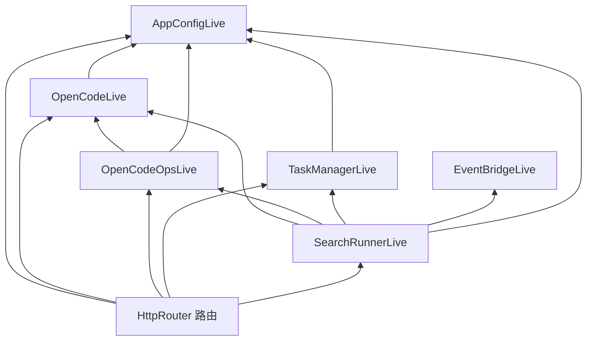
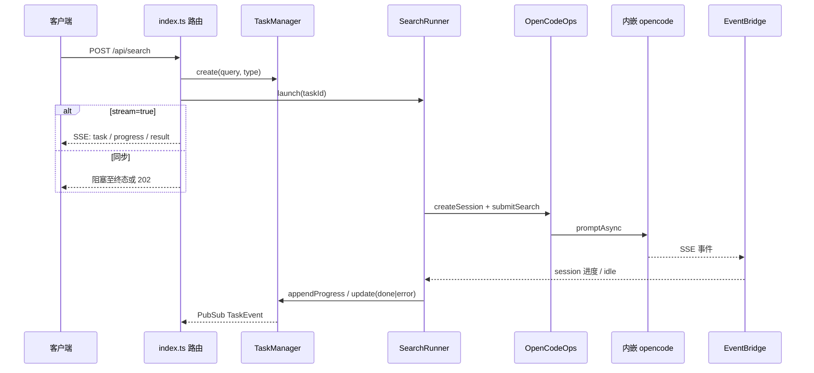

# 架构与依赖

本文描述 search-agent 的目录职责、运行时拓扑、源码模块依赖和 Effect Layer 装配关系。

## 目录结构

```
search-agent/
├── Dockerfile                 # 仅构建 agent 镜像(不含 MCP)
├── docker-compose.yml         # 只拉取远程镜像并部署
├── opencode.jsonc             # 项目级:自定义网关 / MCP / agent
├── opencode.provider.json     # 容器用户级 provider(镜像不跑 auth login)
├── prompts/hanhua-search.md   # 检索 agent 系统提示词
├── websearch.config.yaml      # 本机 websearch-mcpserver 配置(非 Docker)
├── src/
│   ├── index.ts               # 入口:Layer 装配、HTTP 路由、SSE、事件桥
│   ├── env.ts                 # AppConfig:环境变量
│   ├── domain/
│   │   └── search.ts          # 领域 Schema(请求/结果/任务/进度)
│   └── services/
│       ├── opencode.ts        # 内嵌 opencode serve + SDK 操作
│       ├── eventBridge.ts     # opencode SSE → PubSub + 进度翻译
│       ├── taskManager.ts     # 内存任务表 + 事件广播 + 并发信号量
│       └── searchRunner.ts    # 检索编排:提交、等待、解析、写回
└── docs/
    └── architecture.md        # 本文件
```

职责分层:

| 层 | 路径 | 职责 |
|---|---|---|
| 入口 / HTTP | `src/index.ts` | 组装 Layer、暴露 REST/SSE、拉起事件桥 |
| 配置 | `src/env.ts` | 读 `.env` / 进程环境,产出 `AppConfig` |
| 领域 | `src/domain/` | 纯 Schema,不依赖服务 |
| 服务 | `src/services/` | 任务、检索、opencode、事件桥 |
| 运行时配置 | `opencode.jsonc`、`prompts/` | 内嵌 opencode 加载的业务配置 |
| 部署 | `Dockerfile`、`docker-compose.yml` | 构建 agent;compose 只拉镜像 |

## 运行时组件依赖

客户端只打本服务的 HTTP;本服务内嵌 spawn `opencode serve`;opencode 再连自定义 LLM 网关和 websearch MCP。



Docker 部署时两个容器经 compose 内网互联,agent 依赖 websearch 健康后再启动:



## 源码模块依赖

箭头表示 **import** 方向(依赖方 → 被依赖方)。`domain` 与 `env` 不互相引用;服务层可依赖二者,不可反向依赖入口。



外部库:

| 模块 | 直接依赖 |
|---|---|
| `index.ts` | `effect`、`@effect/platform-node` |
| `env.ts` | `effect` |
| `domain/search.ts` | `effect` |
| `opencode.ts` | `effect`、`@opencode-ai/sdk` |
| `eventBridge.ts` | `effect`、`@opencode-ai/sdk`(类型) |
| `taskManager.ts` | `effect` |
| `searchRunner.ts` | `effect`、`@opencode-ai/sdk`(类型) |

## Effect Layer 依赖

运行时由 `Layer.provide` 消化需求。`SearchRunner` 依赖最宽,路由层再消费全部服务。



装配位置在 `src/index.ts` 的 `ServicesLayer`:先 `provide` 掉各 Live 的入参,再 `mergeAll` 成无入参的服务层,HTTP 与事件桥共用同一 context。

## 检索请求流



`eventLoop` 在进程启动时 fork,全局订阅一次 opencode SSE,按 `sessionID` 分发给正在跑的任务。
