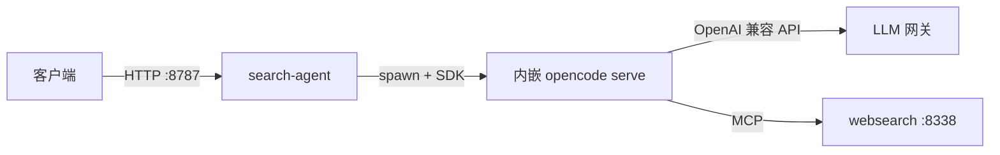
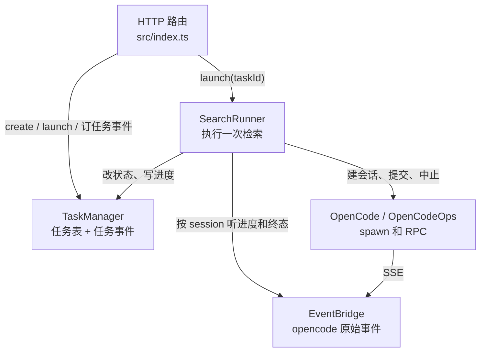
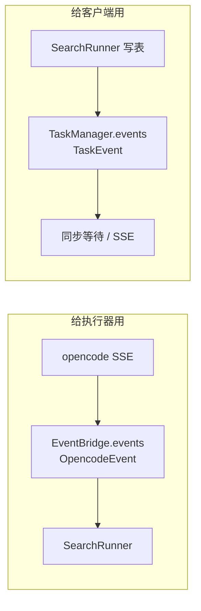
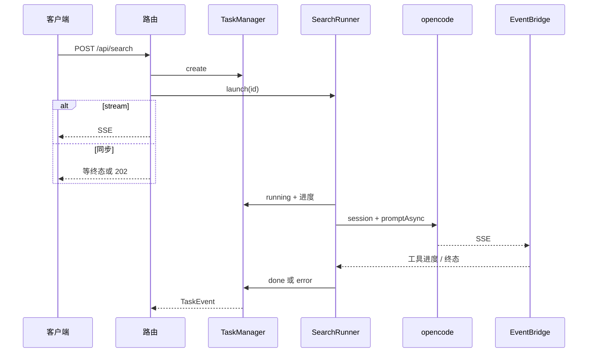

# 架构

search-agent 是一个 HTTP 服务：客户端提交作品名，服务在后台跑一次「汉化检索」agent，返回有没有官方中文 / 民间汉化、证据链接和结构化结论。

进程启动时会 **内嵌 spawn** 一份 `opencode serve`。真正联网搜索的是旁边的 websearch MCP，真正调模型的是你配置的 LLM 网关。本仓库自己不搜网页、不跑模型。



---

## 进程里的四块

HTTP **不直接**调 opencode。中间拆成「任务表」和「执行器」，opencode 的原始事件再单独接一条总线。



| 角色 | 文件 | 一句话 |
|---|---|---|
| 路由 | `src/index.ts` | 收请求、建任务、点火、把结果推回客户端 |
| 任务表 | `taskManager.ts` | 任务存在哪、进度、谁在排队；**对外事件只给 HTTP** |
| 执行器 | `searchRunner.ts` | 拿到 `taskId` 后跑完检索，结果写回任务表 |
| opencode | `opencode.ts` | 拉起 serve，以及建会话 / 提交 prompt / 中止 |
| 事件桥 | `eventBridge.ts` | 把 opencode SSE **翻译并转发给执行器**，不给客户端 |

配置在 `src/env.ts`（`AppConfig`），领域类型在 `src/domain/search.ts`。二者都不依赖上面这些服务。

---

## 两条事件总线（不要混）

乱的主要来源是 **两套 PubSub 都叫 events**。它们方向相反、听众不同。



| | EventBridge.events | TaskManager.events |
|---|---|---|
| 内容 | opencode 原始事件（工具调用、message.updated…） | 本服务的任务进度 / 完成 / 失败 |
| 生产者 | 启动时那条 `eventLoop`（订一次全局 SSE） | `TaskManager.appendProgress` / `update` |
| 消费者 | **只有 SearchRunner**（按 `sessionID` 过滤） | **只有 HTTP**（`syncResponse` / `sseResponse`） |
| 客户端看得到？ | 否 | 是（SSE 或等同步返回） |

SearchRunner **不订** `TaskManager.events`。它只往表上写；写表时 TaskManager 自己往第二条总线发事件，HTTP 才能醒来。

---

## 一次 `POST /api/search`

1. 路由 `TaskManager.create` → 内存里多一条 `queued` 任务。
2. 路由 `SearchRunner.launch(id)` → **立刻返回**（执行在后台 fork）。
3. 然后按 `stream` 分叉：
   - `false`：HTTP 卡住订 `TaskManager.events`，等到本任务 `done`/`error`（或超过 `SYNC_MAX_WAIT` 回 202）。
   - `true`：挂 SSE，把该任务的 `progress` / `result` / `error` 推给客户端。
4. 后台 `launch`：先抢并发槽（`TaskManager.semaphore`），再 `runTask`：
   - 建 opencode session，提交 prompt（带 JSON Schema）
   - 一边听 EventBridge：工具调用 → 中文进度写进任务表
   - 等到 assistant 终态（或超时）→ 解析 `structured` → `done` 或 `error`
5. 槽在 `ensuring` 里还回去。



`GET /api/search/:id` 不订事件，直接读表。进程重启任务就没了。

---

## 各服务再短说一遍

**AppConfig** — 启动时读 `.env`。检索超时、并发上限、模型 id、内嵌 serve 的监听地址都从这里出。

**OpenCode** — `createOpencodeServer` spawn 子进程，给出 `client` 和实际 `url`。挂了会提示：没装 CLI、端口占用、provider 没装上。

**OpenCodeOps** — 用这个 `client` 做 RPC：`createSession`、`submitSearch`（`promptAsync` + Schema）、`abortSession`、`health`。`getLatestAssistant`（从 messages 里找非 compaction 的 assistant）是旧拉结果入口，**主路径已不用**，终态改从 EventBridge 的 `message.updated` 取，避开 messages 反序列化问题。

**EventBridge** — 服务对象只有一个无界 PubSub。`eventLoop` 在 `index.ts` 启动时 fork 一次，断线 5s 重连。`describePartEvent` 把工具名翻成「正在联网搜索:…」这类进度。

**TaskManager** — 唯一任务真相。上限 500 条、每条进度 200。`events` 只给 HTTP。并发槽也放这里，但 `take`/`release` 由 SearchRunner 手动做（避免 `withPermits` 把超时包死）。

**SearchRunner** — 对外只有 `launch(taskId)`。不存任务、不跟客户端说话，只编排 opencode 并把结果写回表。

---

## 依赖怎么接上

没有 `new TaskManager()`。每个服务是 Effect 的 **tag**（`yield* TaskManager` 表示从 Context 取）。

实现写在 `XxxLive` 里，缺的依赖用 `Layer.provide` 补。装配全在 `src/index.ts`：

```
AppConfigLive          无依赖，读环境
OpenCodeLive           需要 AppConfig
OpenCodeOpsLive        需要 OpenCode + AppConfig
TaskManagerLive        需要 AppConfig
EventBridgeLive        无依赖
SearchRunnerLive       需要上面几乎全部
```

`Layer.build(ServicesLayer)` 时各 Live 跑一遍，同一份实例放进 Context。HTTP 和 SearchRunner 拿到的是**同一张任务表**。

---

## 目录（和运行无关的放最后）

```
src/index.ts                 入口：装配 + 路由 + 拉起 eventLoop
src/env.ts                   AppConfig
src/domain/search.ts         请求 / 任务 / 结果 Schema
src/services/taskManager.ts
src/services/searchRunner.ts
src/services/opencode.ts
src/services/eventBridge.ts
opencode.jsonc               内嵌 opencode：网关、MCP、agent
prompts/hanhua-search.md     检索提示词
Dockerfile                   只构建 agent
docker-compose.yml           拉 agent + websearch 镜像
```

Docker 下 agent 等 websearch healthy 后再起，MCP 地址是 `http://websearch:8338/mcp`。模型用环境变量 `LLM_BASE_URL` / `LLM_API_KEY` / `LLM_MODEL`，不绑死厂商。
